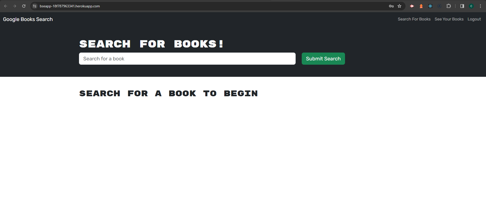

# Book Search Engine

Welcome to our Book Search Engine – your go-to place for finding awesome books and keeping track of your reading adventures. 📚✨

## What's This All About?

You're itching to find a new book to dive into, but you're not sure where to start. That's where our Book Search Engine comes in handy! It's like having your own personal book detective. You can search for any book under the sun and get all the juicy details right at your fingertips.



## Table of Contents

- [Link to Deployed Application](#link-to-deployed-application)
- [Installation](#installation)
- [How it works](#how-it-works)
- [License](#license)
- [Contributing](#contributing)
- [Questions](#questions)
- [Technologies Used](#technologies-used)

## Link to Deployed Application

[Link to Deployed Application](https://bseapp-18f787963341.herokuapp.com/)

## Installation

To set up the Social Media WebApp on your local machine, follow these steps:

1. Clone the project repository to your local storage:

```
git clone
```

2. Open your terminal and navigate to the cloned project directory:

```
cd bookSearchEngine
```

3. Install the required dependencies:

```
npm install
```

4. Set up the MongoDB database:

5. Start the application:

```
npm start
```

6. Access the application in your web browser at http://localhost:3001 for local environment.

## How It Works

1. **Search for Books:**
   - Type in a book title, author, or any keyword that strikes your fancy.
   - Hit that search button and voilà! You'll get a list of books matching your query.

2. **Login/Signup:**
   - Wanna save your favorite finds? Cool, just login or signup to create your own little book haven.
   - Not a member yet? No worries, it only takes a sec to sign up.

3. **Save Your Picks:**
   - Found a gem you wanna revisit later? Hit the "save" button and it's all yours.

4. **See Your Collection:**
   - Curious about what you've saved? Check out your personalized collection of saved books.

5. **Remove If Needed:**
   - Changed your mind about a book? No problemo! Just click "remove" and it's gone from your stash.

6. **Logout:**
   - All done? Hit logout and we'll see you next time!


## License

This project is licensed under the MIT license.

## Contributing

Please feel free to submit pull requests or open issues to improve the application functionality.

## Questions

For any questions, please contact me.

## Technologies Used

### The application is built with the following technologies:

Apollo Server
Bcrypt
Express
GraphQL
Mongoose
Nodemon
Apollo Client
Bootstrap
Dotenv
GraphQL
JWT
React
React Bootstrap
Vite
ESLint

